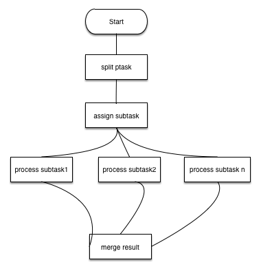
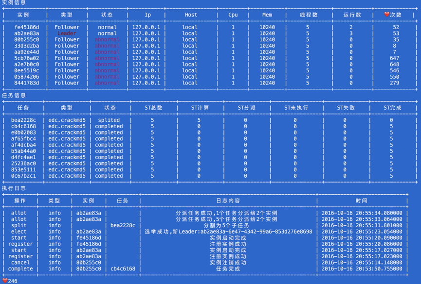

        _______________
        <I am EasyDc >                   
        ---------------                              
                \   ^__^
                 \  (oo)\_______
                    (__)\       )\/\  
                        ||----w |
                        ||     ||

V1.0.0
## Easydc
> * 一个简单易用的分布式计算框架
> * 把一个大任务分割为多个子任务，分派给多个运算单元执行，最后合并各个子任务运算结果

流程图


## 使用说明

### 实例实现
* 一个进程只可以启动一个运算实例
* 实例必须有一个唯一Id，可以使用uuid4生成
* 实例注册时需要传出IP ,其余参数可选
```
    hostname － 服务器host
    dockerName - docker 名称 
    cpu  - cpu 使用比例
    mem  - 内存大小
    weight － 子任务分派权重 
```
* 实例启动时需传入执行实现,执行者实现参考下文
* 代码示例参考__main__.py文件

 启动实例
 ```python
 python -m easydc
 ```

### 执行者实现
* 执行者为业务代码最终实现
* 执行者需要继承TaskExecutor,实现compute和merge方法
```
    def compute(self,task):
        '''计算子任务
            参数：
                task － 子任务
            返回：
                子任务运算结果
        '''
    def merge(self,tasks):
        '''合并任务
            tasks － 子任务列表
        '''
```
* 每个执行者有唯一的id用来区分业务, 例如:id = 'edc.crackmd5'
* 强制关闭父任务，如果一个子任务计算完成，强制关闭其它子任务
```
    self.ali.finishPTask(self.ptaskId)   #强制关闭父任务
    self.ali.checkFinished(self.ptaskId) #检查父任务是否完成
```
* 更新执行进度, 进度比例需要自己实现
```
self.ali.updateProcess(self.subTaskId,process)
```
* 代码示例参考executor.md5executor.py

###分割任务
* 一个任务分割为多个子任务
* 调用分割接口实现分割功能 
```
    taskSplit = TaskSplit()
    bizType = '业务类型' #同执行ID
    bizPtask = '父业务信息' 
    bizSubTasks = [] #子任务信息，定义任务分割规则
    taskSplit.run(bizType,bizPtask,bizSubTasks)
```

* 代码示例参考split.py

分割任务
```
    python split.py
```

### 监控任务
* 监控运算实例和任务运行情况

监控命令
```
python monitor.py  --tick=5
```

监控页面



## 设计文档

[分布式计算框架设计方案](https://github.com/golbj2015/easydc/blob/master/doc/%E5%88%86%E5%B8%83%E5%BC%8F%E8%AE%A1%E7%AE%97%E6%A1%86%E6%9E%B6%E8%AE%BE%E8%AE%A1%E6%96%87%E6%A1%A3.md)
